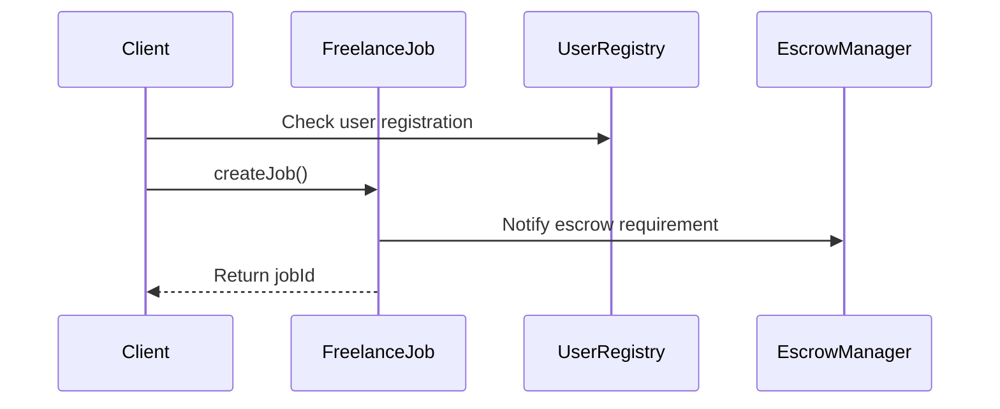
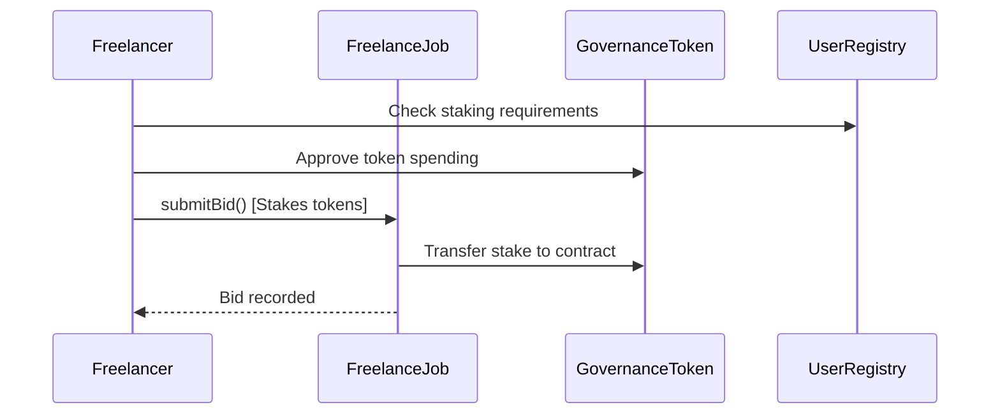
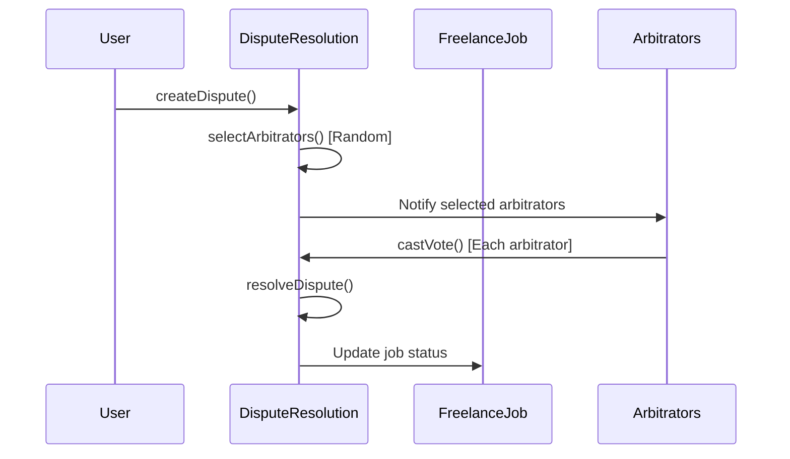

# Smart Contracts Documentation

## 🏗️ Contract Architecture

The platform consists of 5 main smart contracts that work together to provide a decentralized freelancing ecosystem.

```
┌─────────────────┐    ┌─────────────────┐    ┌─────────────────┐
│   UserRegistry  │◄──►│  FreelanceJob   │◄──►│ EscrowManager   │
│                 │    │                 │    │                 │
│ • User profiles │    │ • Job creation  │    │ • Fund holding  │
│ • Reputation    │    │ • Bidding       │    │ • Auto release  │
│ • Staking       │    │ • Selection     │    │ • Multi-token   │
└─────────────────┘    └─────────────────┘    └─────────────────┘
         │                       │                       │
         └───────────────────────┼───────────────────────┘
                                 │
┌─────────────────┐    ┌─────────────────┐
│DisputeResolution│    │ GovernanceToken │
│                 │    │                 │
│ • Arbitrator    │    │ • ERC20 token   │
│ • Voting        │    │ • Staking       │
│ • Resolution    │    │ • Governance    │
└─────────────────┘    └─────────────────┘
```

## 📋 Contract Specifications

### 1. FreelanceJob.sol

**Purpose**: Core contract managing job lifecycle from creation to completion.

```solidity
// SPDX-License-Identifier: MIT
pragma solidity ^0.8.19;

contract FreelanceJob {
    struct Job {
        uint256 id;
        address client;
        address freelancer;
        string title;
        string description;
        string category;
        uint256 budget;
        address paymentToken;
        uint256 deadline;
        JobStatus status;
        string ipfsHash;
        uint256 createdAt;
        uint256 completedAt;
    }

    struct Bid {
        address freelancer;
        uint256 amount;
        uint256 deliveryTime;
        string proposal;
        uint256 stakedAmount;
        bool isActive;
    }

    enum JobStatus {
        Open,           // 0 - Job posted, accepting bids
        Assigned,       // 1 - Freelancer selected
        InProgress,     // 2 - Work in progress
        Submitted,      // 3 - Work submitted for review
        Completed,      // 4 - Job completed successfully
        Disputed,       // 5 - In dispute resolution
        Cancelled       // 6 - Job cancelled
    }

    // Events
    event JobCreated(uint256 indexed jobId, address indexed client, uint256 budget);
    event BidSubmitted(uint256 indexed jobId, address indexed freelancer, uint256 amount);
    event FreelancerSelected(uint256 indexed jobId, address indexed freelancer);
    event WorkSubmitted(uint256 indexed jobId, string deliverableHash);
    event JobCompleted(uint256 indexed jobId);
    event DisputeRaised(uint256 indexed jobId);

    // Core Functions
    function createJob(
        string memory _title,
        string memory _description,
        string memory _category,
        uint256 _budget,
        address _paymentToken,
        uint256 _deadline,
        string memory _ipfsHash
    ) external returns (uint256);

    function submitBid(
        uint256 _jobId,
        uint256 _amount,
        uint256 _deliveryTime,
        string memory _proposal
    ) external;

    function selectFreelancer(uint256 _jobId, address _freelancer) external;
    function submitWork(uint256 _jobId, string memory _deliverableHash) external;
    function approveWork(uint256 _jobId) external;
    function raiseDispute(uint256 _jobId, string memory _reason) external;
}
```

**Key Features**:
- Job creation with IPFS metadata storage
- Bid submission with token staking mechanism
- Automatic escrow integration
- Work submission and approval workflow
- Dispute initiation system

### 2. EscrowManager.sol

**Purpose**: Manages fund escrow, multi-token support, and automatic payment release.

```solidity
// SPDX-License-Identifier: MIT
pragma solidity ^0.8.19;

import "@openzeppelin/contracts/security/ReentrancyGuard.sol";
import "@openzeppelin/contracts/token/ERC20/IERC20.sol";

contract EscrowManager is ReentrancyGuard {
    struct Escrow {
        uint256 jobId;
        address client;
        address freelancer;
        address token;
        uint256 amount;
        uint256 releaseTime;
        bool isReleased;
        bool isRefunded;
    }

    mapping(uint256 => Escrow) public escrows;
    mapping(address => bool) public supportedTokens;
    
    uint256 public constant AUTO_RELEASE_DELAY = 7 days;
    
    // Events
    event EscrowCreated(uint256 indexed jobId, uint256 amount, address token);
    event FundsReleased(uint256 indexed jobId, address to, uint256 amount);
    event FundsRefunded(uint256 indexed jobId, address to, uint256 amount);
    event AutoReleaseTriggered(uint256 indexed jobId);

    // Core Functions
    function createEscrow(
        uint256 _jobId,
        address _freelancer,
        address _token,
        uint256 _amount
    ) external payable;

    function releaseFunds(uint256 _jobId) external;
    function refundFunds(uint256 _jobId) external;
    function autoRelease(uint256 _jobId) external;
    
    // Admin Functions
    function addSupportedToken(address _token) external onlyOwner;
    function removeSupportedToken(address _token) external onlyOwner;
}
```

**Key Features**:
- Multi-token escrow support (ETH, USDC, USDT, etc.)
- Automatic release mechanism after 7 days
- Reentrancy protection
- Emergency refund capability

### 3. UserRegistry.sol

**Purpose**: User management, reputation system, and staking mechanism.

```solidity
// SPDX-License-Identifier: MIT
pragma solidity ^0.8.19;

contract UserRegistry {
    struct User {
        address userAddress;
        string profileHash; // IPFS hash
        UserType userType;
        uint256 reputation;
        uint256 totalJobs;
        uint256 successfulJobs;
        uint256 stakedAmount;
        bool isActive;
        uint256 joinedAt;
    }

    struct Skill {
        string name;
        uint256 level; // 1-5
        uint256 verifications;
    }

    enum UserType {
        Client,
        Freelancer,
        Both
    }

    mapping(address => User) public users;
    mapping(address => Skill[]) public userSkills;
    mapping(address => mapping(address => bool)) public hasRated;
    
    uint256 public constant MIN_STAKE_AMOUNT = 100 * 10**18; // 100 tokens
    
    // Events
    event UserRegistered(address indexed user, UserType userType);
    event ProfileUpdated(address indexed user, string profileHash);
    event ReputationUpdated(address indexed user, uint256 newReputation);
    event StakeDeposited(address indexed user, uint256 amount);
    event StakeWithdrawn(address indexed user, uint256 amount);

    // Core Functions
    function registerUser(
        UserType _userType,
        string memory _profileHash
    ) external;

    function updateProfile(string memory _profileHash) external;
    function addSkill(string memory _skillName, uint256 _level) external;
    function stakeTokens(uint256 _amount) external;
    function withdrawStake(uint256 _amount) external;
    function updateReputation(address _user, uint256 _rating, bool _successful) external;
}
```

**Key Features**:
- Dual-role support (Client/Freelancer/Both)
- IPFS-based profile storage
- Reputation calculation algorithm
- Token staking for quality assurance
- Skill verification system

### 4. DisputeResolution.sol

**Purpose**: Decentralized dispute resolution with random arbitrator selection.

```solidity
// SPDX-License-Identifier: MIT
pragma solidity ^0.8.19;

contract DisputeResolution {
    struct Dispute {
        uint256 jobId;
        address client;
        address freelancer;
        string reason;
        uint256 createdAt;
        DisputeStatus status;
        address[] arbitrators;
        mapping(address => Vote) votes;
        uint256 votesForClient;
        uint256 votesForFreelancer;
        address winner;
    }

    struct Vote {
        bool hasVoted;
        bool voteForClient;
        string reasoning;
        uint256 timestamp;
    }

    struct Arbitrator {
        address arbitratorAddress;
        uint256 reputation;
        uint256 totalCases;
        uint256 successfulCases;
        bool isActive;
        uint256 stakedAmount;
    }

    enum DisputeStatus {
        Open,       // 0 - Dispute created, selecting arbitrators
        Voting,     // 1 - Arbitrators voting
        Resolved,   // 2 - Dispute resolved
        Appealed    // 3 - Under appeal
    }

    mapping(uint256 => Dispute) public disputes;
    mapping(address => Arbitrator) public arbitrators;
    address[] public activeArbitrators;
    
    uint256 public constant ARBITRATOR_COUNT = 3;
    uint256 public constant VOTING_PERIOD = 3 days;
    uint256 public constant MIN_ARBITRATOR_STAKE = 1000 * 10**18;

    // Events
    event DisputeCreated(uint256 indexed jobId, address indexed client, address indexed freelancer);
    event ArbitratorsSelected(uint256 indexed jobId, address[] arbitrators);
    event VoteCast(uint256 indexed jobId, address indexed arbitrator, bool voteForClient);
    event DisputeResolved(uint256 indexed jobId, address winner);

    // Core Functions
    function createDispute(uint256 _jobId, string memory _reason) external;
    function selectArbitrators(uint256 _jobId) external;
    function castVote(uint256 _jobId, bool _voteForClient, string memory _reasoning) external;
    function resolveDispute(uint256 _jobId) external;
    
    // Arbitrator Functions
    function registerAsArbitrator() external;
    function stakeAsArbitrator(uint256 _amount) external;
    function withdrawArbitratorStake(uint256 _amount) external;
}
```

**Key Features**:
- Random arbitrator selection using VRF
- 3-arbitrator panel for each dispute
- Voting period with reasoning requirements
- Arbitrator reputation and staking system
- Appeal mechanism for complex cases

### 5. GovernanceToken.sol

**Purpose**: Platform governance token with staking and voting capabilities.

```solidity
// SPDX-License-Identifier: MIT
pragma solidity ^0.8.19;

import "@openzeppelin/contracts/token/ERC20/ERC20.sol";
import "@openzeppelin/contracts/token/ERC20/extensions/ERC20Votes.sol";
import "@openzeppelin/contracts/security/Pausable.sol";

contract GovernanceToken is ERC20, ERC20Votes, Pausable {
    uint256 public constant MAX_SUPPLY = 1_000_000_000 * 10**18; // 1B tokens
    uint256 public constant INITIAL_SUPPLY = 100_000_000 * 10**18; // 100M tokens
    
    mapping(address => uint256) public stakingBalances;
    mapping(address => uint256) public stakingTimestamps;
    
    uint256 public constant MIN_STAKING_PERIOD = 30 days;
    uint256 public stakingRewardRate = 5; // 5% APY

    // Events
    event TokensStaked(address indexed user, uint256 amount);
    event TokensUnstaked(address indexed user, uint256 amount);
    event RewardsDistributed(address indexed user, uint256 amount);

    constructor() ERC20("FreelanceDAO", "FDAO") ERC20Permit("FreelanceDAO") {
        _mint(msg.sender, INITIAL_SUPPLY);
    }

    // Staking Functions
    function stake(uint256 _amount) external {
        require(_amount > 0, "Amount must be greater than 0");
        require(balanceOf(msg.sender) >= _amount, "Insufficient balance");
        
        _transfer(msg.sender, address(this), _amount);
        stakingBalances[msg.sender] += _amount;
        stakingTimestamps[msg.sender] = block.timestamp;
        
        emit TokensStaked(msg.sender, _amount);
    }

    function unstake(uint256 _amount) external {
        require(stakingBalances[msg.sender] >= _amount, "Insufficient staked balance");
        require(
            block.timestamp >= stakingTimestamps[msg.sender] + MIN_STAKING_PERIOD,
            "Minimum staking period not met"
        );
        
        stakingBalances[msg.sender] -= _amount;
        _transfer(address(this), msg.sender, _amount);
        
        emit TokensUnstaked(msg.sender, _amount);
    }

    function claimRewards() external {
        uint256 stakingDuration = block.timestamp - stakingTimestamps[msg.sender];
        uint256 rewards = calculateRewards(msg.sender, stakingDuration);
        
        if (rewards > 0) {
            _mint(msg.sender, rewards);
            stakingTimestamps[msg.sender] = block.timestamp;
            emit RewardsDistributed(msg.sender, rewards);
        }
    }

    function calculateRewards(address _user, uint256 _duration) public view returns (uint256) {
        uint256 stakedAmount = stakingBalances[_user];
        return (stakedAmount * stakingRewardRate * _duration) / (365 days * 100);
    }

    // Override required by Solidity
    function _afterTokenTransfer(address from, address to, uint256 amount)
        internal
        override(ERC20, ERC20Votes)
    {
        super._afterTokenTransfer(from, to, amount);
    }

    function _mint(address to, uint256 amount)
        internal
        override(ERC20, ERC20Votes)
    {
        super._mint(to, amount);
    }

    function _burn(address account, uint256 amount)
        internal
        override(ERC20, ERC20Votes)
    {
        super._burn(account, amount);
    }
}
```

## 🔗 Contract Interactions

### Job Creation Flow


### Bidding Flow


### Dispute Resolution Flow


## 📊 Gas Optimization Strategies

### 1. Struct Packing
```solidity
// Optimized struct packing to save gas
struct Job {
    uint256 id;           // slot 0
    address client;       // slot 1 (20 bytes)
    uint96 budget;        // slot 1 (12 bytes) - packed with client
    address freelancer;   // slot 2 (20 bytes)
    uint32 deadline;      // slot 2 (4 bytes) - packed with freelancer
    JobStatus status;     // slot 2 (1 byte) - packed
    bool isActive;        // slot 2 (1 byte) - packed
}
```

### 2. Batch Operations
```solidity
function batchApproveJobs(uint256[] calldata _jobIds) external {
    for (uint256 i = 0; i < _jobIds.length; i++) {
        _approveJob(_jobIds[i]);
    }
}
```

### 3. Events vs Storage
```solidity
// Use events for data that doesn't need on-chain querying
event JobMetadata(uint256 indexed jobId, string ipfsHash);

// Use storage only for essential data
mapping(uint256 => JobCore) public jobs;
```

## 🔒 Security Measures

### 1. Access Control
```solidity
modifier onlyJobParticipant(uint256 _jobId) {
    Job memory job = jobs[_jobId];
    require(
        msg.sender == job.client || msg.sender == job.freelancer,
        "Not authorized"
    );
    _;
}
```

### 2. Reentrancy Protection
```solidity
import "@openzeppelin/contracts/security/ReentrancyGuard.sol";

function releaseFunds(uint256 _jobId) external nonReentrant {
    // Safe external calls
}
```

### 3. Integer Overflow Protection
```solidity
// Using Solidity ^0.8.0 built-in overflow protection
// Additional checks for critical calculations
function calculateReward(uint256 _amount) internal pure returns (uint256) {
    require(_amount <= type(uint256).max / 100, "Overflow risk");
    return _amount * rewardRate / 100;
}
```

## 🧪 Testing Strategy

### Unit Tests
```javascript
describe("FreelanceJob", function () {
  it("Should create a job successfully", async function () {
    const tx = await freelanceJob.createJob(
      "Test Job",
      "Description",
      "Development",
      ethers.utils.parseEther("1"),
      ethers.constants.AddressZero, // ETH
      Math.floor(Date.now() / 1000) + 86400, // 1 day
      "QmTest..."
    );
    
    expect(tx).to.emit(freelanceJob, "JobCreated");
  });
});
```

### Integration Tests
```javascript
describe("Full Job Lifecycle", function () {
  it("Should complete a job from creation to payment", async function () {
    // Create job
    // Submit bid
    // Select freelancer
    // Submit work
    // Approve and release payment
  });
});
```

## 📈 Deployment Configuration

### Mainnet Configuration
```javascript
module.exports = {
  networks: {
    mainnet: {
      url: process.env.MAINNET_RPC_URL,
      accounts: [process.env.PRIVATE_KEY],
      gasPrice: 20000000000, // 20 gwei
      gas: 6000000
    },
    polygon: {
      url: process.env.POLYGON_RPC_URL,
      accounts: [process.env.PRIVATE_KEY],
      gasPrice: 30000000000 // 30 gwei
    }
  }
};
```

### Verification Script
```javascript
async function verifyContracts() {
  await hre.run("verify:verify", {
    address: contractAddress,
    constructorArguments: [...args],
  });
}
```

This comprehensive smart contract documentation provides everything needed to understand and implement the blockchain layer of your freelancing platform. Each contract is designed with security, gas optimization, and scalability in mind.